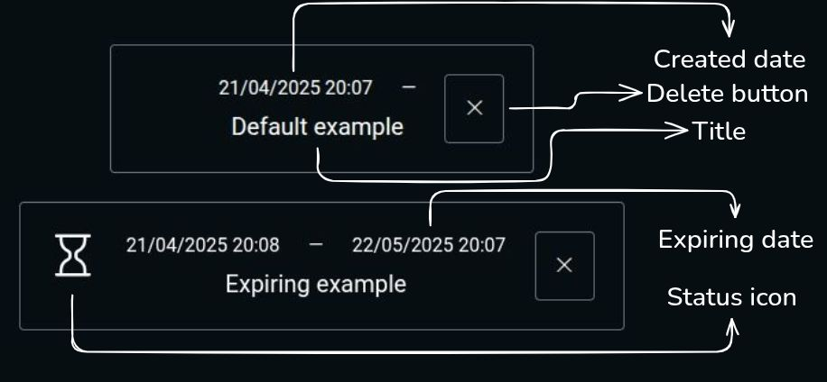

## Table of contents
- [How to access](#how-to-access)
- [How to use](#how-to-use)
- [Demo](#demo)
- [Technologies](#technologies)
- [Technical decisions](#technical-decisions)
- [Support](#support)
- [License](#license)

# To-do list [🔝](#table-of-contents)
A simple and effective To-do list to keep track of your chores.

## How to access [🔝](#table-of-contents)
You can access the application through [here](#table-of-contents) or you can click the link on the `about` section.

## Demo [🔝](#table-of-contents)

## How to use [🔝](#table-of-contents)
- Under the *Create your to-do* title there is a form. There's 3 inputs in it for: The title of your to-do, which is required; the description of your to-do, which is *not* required and the expiration date, which is also *not* required. After filling all the details you can press the button to the right. Your to-do will be created and inserted in your list.
- Below the *Create your to-do* section, which contains the form to create a to-do, there's the filter section used to filter your to-dos.
    - The first button displays a dropdown with 4 options: Default; Concluded; Cancelled and Ticking. These are for the **status** of you to-dos. Clicking on one of them will only display to-dos with that status.
    - The second button displays another dropdown with, also, 4 options: Default; Alphabet; Created and Expiring. These are for the **attribute** of your to-dos. Clicking on one of them will sort you to-dos, in ascending order, to display the one you chose first.
- After the filter section comes your to-do list section which displays all of your to-dos.
    - Your to-do is composed by 7 elements.
    At first you'll only see the *title*, the *created date* and the *delete button*. If you created a to-do with an *expiring date* the only differences will be the *status icon* at the left side and the *expiring date* along the *created date*. Here's a visual representation:
    

    - Hovering the title will display the description.
    - Clicking on the to-do will change its status in the following order: Default; Concluded; Cancelled and Ticking.
    - You can rearrange their order by dragging and dropping them. This can also be done, but with a little limit, on your phone, just click the *move icon* which is on the left side of the *delete button*.
- There's also a button used to import or export your to-dos. Clicking the button will display a dropdown with 2 options: Export to-dos and import to-dos.
    - Choosing *export* will download a JSON file containing all your to-dos.
    - Choosing *import* will open a window for you to choose a JSON file containing previous to-dos. After clicking the *Render to-dos* your file will be read and your to-dos will be added to your list.
- The app also comes with a button to switch themes, going from dark to light.
- **All to-dos are saved locally** and if you rearrange your to-dos your order will be saved for the next time you enter the app.

## Technologies [🔝](#table-of-contents)
- HTML, CSS, modular Javascript
- Dynamic import 
- `localStorage` and `Blob` for download

## Technical decisions [🔝](#table-of-contents)
1. **Why modularize**? Better organization, reusability, and maintenance. Each important function is in its own file, so I know exactly where to find it. I can import a function without duplicating code. If an error occurs, the console shows the exact file and line, making debugging faster than scrolling through 1000+ lines.
2. **Why did I chose dynamic import**? To avoid loading functions the user won't use. For example: if you only want to view tasks, there's no need to load functions for exporting or importing data. Dynamic import keeps the app lighter and faster.
3. **Why `localStorage` instead of a backend**? To persist user data without needing a backend. If you want to access your tasks at work, you can export them as a file and import later.
4. **Why `blob`**? The Blob API allows exporting tasks as a downloadable JSON file.
5. **How did I implement `drag & drop` mobile** ? It works with `touchstart`, `touchmove`, `touchend` and `touchcancel`.
In short:
`touchstart`: Detects the element to be moved.
`touchmove`: Prevents scrolling, reorders the element based on finger position and saves the new order.  
`touchend`/`touchcancel`: Finalizes or cancels the move.

Some functions are statically imported, others dynamically. I avoided dynamically importing everything because some functions were tricky to implement that way — pragmatic choice! 👍

## Support [🔝](#table-of-contents)
You can contact me through [contatoguilherme83@gmail.com](mailto:contatoguilherme83@gmail.com).

I accept any recommendations regarding the application. I'd be happy to add a little piece of every new idea so another person could study it.

Any found bugs can and should be reported through the `issues` section.

## License [🔝](#table-of-contents)

This project is licensed under the [MIT License](/license.txt)